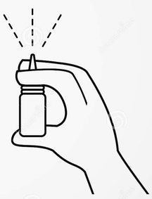
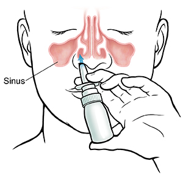

# How to take RadVax vaccine
RadVax is an open-source vaccine, designed to be safe.  It recruits a different part of the immune system than commercial vaccines, so it is not a substitute.  Using both RadVax and a commercial vaccine will provide more protection than using either one alone.

# You will need:
- RadVax bottle
- alcohol wipe
- kleenex

# The first use
The first time you use the bottle, you will need to prime it.  To prime the bottle:
- Remove the cap.
- Hold the bottle upright.
- Place your thumb on the bottom of the bottle, and place your first and second fingers on the pump.

- Pump the bottle by pressing your fingers downward.  After 1-3 pumps, you should see a mist.
- As soon as you see a mist, the bottle is primed and ready to use.

If you do not see a mist after 4 pumps, try cleaning the nozzle of the bottle.

# To take the vaccine
- Blow your nose thoroughly, to clean your nasal passages.
- Remove the lid, then wipe the nozzle with an alcohol swab.
- Keeping the bottle upright, place the tip of the nozzle in one nostril.
	- Leave the other nostril alone.
- Breathe deeply through your nose, as though you were smelling a flower.
- **While breathing in through your nose, pump the lid once.**
	- You will feel the mist in your nose.  
- Breathe out through your mouth.
- **Switch the nozzle to the other nostril**, then pump the lid once.

Next steps:
- Try not to let the vaccine drip out your nose (it may help to tilt your head backwards). 
- Wait a few minutes, then **spray once into each nostril again**.
	- You should pump **4 times in total** (twice into each nostril).

Do not blow your nose for 2 hours after administering the vaccine.

# General Notes
You should take the vaccine **3-4 times**, spaced about **7 to 10 days apart**.

When not in use, **store the bottle upright**, in the refrigerator, with the cap on the lid.  Do not freeze the bottle.

When refrigerated, the vaccine will last for about 2 weeks before losing its effectiveness.

If you have received only one bottle, then take it the day you receive it, then one week later, and then one week after that.

