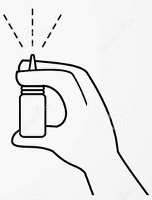
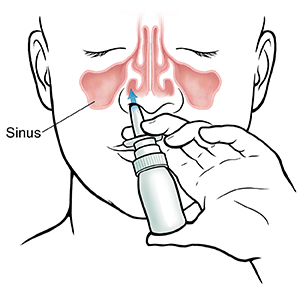

# Cómo tomar la vacuna RaDVaC

RadVax es una vacuna segura y sus creadores hicieron sus componentes y proceso de producción publica. Estimula una parte diferente del sistema inmunológico que las vacunas comerciales, por lo que no es un sustituto. El uso de RadVac y una vacuna comercial proporcionará más protección que el uso de cualquiera de ellas independientemente.

# Necesitará:
- Botella RadVax
- toallita de alcohol
- Pañuelo desechable 

# El primer uso:
La primera vez que use la botella, deberá prepararla. Para preparar la botella:

- Quite la tapa.
- Sostenga la botella en posición vertical.
- Coloque su pulgar en la parte inferior de la botella y coloque sus dedos indice y anular sobre la bomba.
- Bombee la botella presionando los dedos hacia abajo. Después de 1-4 bombeos, debería ver una nube de liquido.
- Tan pronto como vea la nube, la botella estará  lista para usar.

Si no ve una nube después de 4 bombeos, intente limpiar la boquilla de la botella.

# Para ponerse la vacuna:
- Suénese bien la nariz para limpiar sus fosas nasales.
- Agitar suavemente la botella.
- Retire la tapa y luego limpie la boquilla con un paño de alcohol.
- Manteniendo la botella en posición vertical, coloque la punta de la boquilla en una fosa nasal.
  - No tape la otra fosa nasal.
- Respire profundamente por la nariz, como si estuviera oliendo una flor.
- Mientras inhala por la nariz, bombee la tapa una vez.
  - Sentirás el liquido en tu nariz.
- Exhale por la boca.
- Cambie la boquilla a la otra fosa nasal, luego repita.

- Trate de que la vacuna no se le escurra por su nariz (puede ayudar a inclinar la cabeza hacia atrás).
- Espere unos minutos, luego rocíe una vez en cada fosa nasal nuevamente.
  - Debe bombear 4 veces en total (dos veces en cada fosa nasal).

No se suene la nariz durante las 2 horas posteriores a la administración de la vacuna.

# Notas generales:

Debe aplicarse la vacuna 4 veces, con un intervalo de entre 7 y 10 días.

Cuando no esté en uso, guarde la botella en posición vertical, en el refrigerador, con la tapa en la boquilla. No congele la botella.

Cuando se refrigera la vacuna durará, aproximadamente 2 semanas antes de perder su eficacia.
